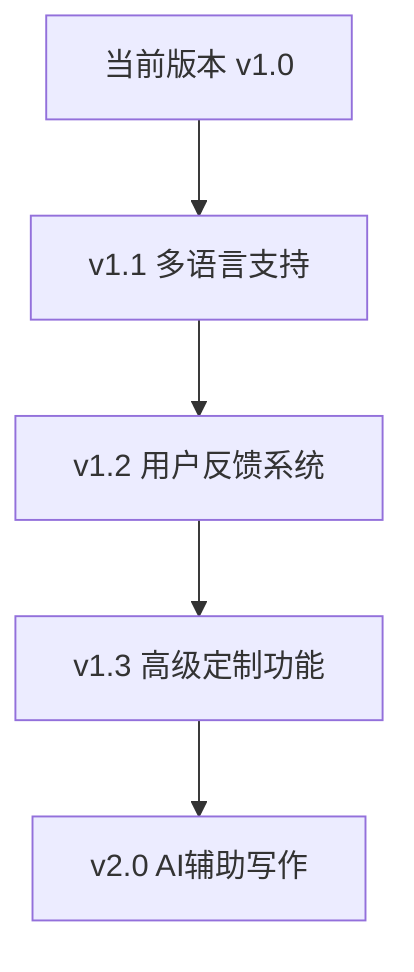

# 青阳博客 - 官方网站

[](https://nextjs.org/)
[](https://www.typescriptlang.org/)
[](https://tailwindcss.com/)
[](LICENSE)

**青阳博客**是一个专为写作者设计的博客平台官方网站，让您在10分钟内将笔记转换为专业的博客网站，无需编程知识。

🌐 **在线预览**: [青阳博客官网](https://blog-official-website.vercel.app)

## ✨ 核心特性

- 🚀 **零技术门槛** - 无需编程知识，3步完成博客部署
- 📝 **无缝笔记对接** - 支持Obsidian、Typora、Notion等15+主流笔记软件
- ⚡ **一键部署** - 平均5分钟拥有专业博客网站
- 🌍 **全球访问** - CDN加速，99.9%可用性保证
- 📱 **响应式设计** - 完美适配手机、平板、电脑所有设备
- 🔍 **智能搜索** - 全文搜索，标签分类，内容推荐
- 🔒 **安全可靠** - GitHub存储，Vercel托管，数据永不丢失

## 🎯 目标用户

| 用户类型 | 痛点 | 解决方案 |
|---------|------|---------|
| **写作爱好者** | 技术门槛太高，不会建站 | 零代码操作，只需会用记事本 |
| **自媒体创作者** | 部署太复杂，维护困难 | 3步完成，比发朋友圈还简单 |
| **知识工作者** | 笔记无法有效分享传播 | 一键转换，让知识产生价值 |
| **学生群体** | 学习笔记缺乏展示平台 | 专业界面，提升个人影响力 |

## 🛠️ 技术架构

```
青阳博客官网
├── 前端框架: Next.js 14.0.4
├── 开发语言: TypeScript 5.0+
├── 样式方案: Tailwind CSS 3.3.0
├── 图标库: Lucide React
├── 部署平台: Vercel
└── 包管理器: npm
```

## 📁 项目结构

```
青阳-博客-官网/
├── 📁 public/                 # 静态资源
│   └── 🎨 favicon.ico        # 网站图标
├── 📁 src/                   # 源代码目录
│   ├── 📁 app/              # Next.js App Router
│   │   ├── 📄 about/        # 关于我们页面
│   │   ├── 📄 blog/         # 示例博客页面
│   │   ├── 📄 deploy/       # 部署指南页面
│   │   ├── 📄 features/     # 功能特性页面
│   │   ├── 🎨 globals.css   # 全局样式
│   │   ├── ⚛️ layout.tsx    # 根布局组件
│   │   └── 🏠 page.tsx      # 首页组件
│   └── 📁 components/       # 共享组件
│       ├── 🦶 Footer.tsx    # 页脚组件
│       └── 🧭 Navigation.tsx # 导航组件
├── ⚙️ next.config.js        # Next.js 配置
├── 📦 package.json          # 项目依赖
├── 🎨 tailwind.config.js    # Tailwind 配置
├── 📝 tsconfig.json         # TypeScript 配置
└── 📖 README.md             # 项目说明
```

## 🚀 快速开始

### 环境要求

- **Node.js**: 18.0+ 
- **包管理器**: npm、yarn 或 pnpm
- **操作系统**: Windows、macOS、Linux

### 本地开发

```bash
# 1. 克隆项目
git clone https://github.com/your-username/blog_official_website.git
cd blog_official_website

# 2. 安装依赖
npm install

# 3. 启动开发服务器
npm run dev

# 4. 打开浏览器访问
# http://localhost:3000
```

### 构建部署

```bash
# 构建生产版本
npm run build

# 启动生产服务器
npm start

# 代码质量检查
npm run lint
```

## 🎨 页面展示

### 🏠 首页 (/)
- **产品介绍**: 10分钟建站承诺
- **功能展示**: 核心特性可视化展示
- **用户案例**: 真实用户使用效果
- **行动引导**: 引导用户开始使用

### ⚡ 功能特性 (/features)
- **功能对比**: 与传统方案的优势对比
- **技术特性**: 6大核心功能详解
- **用户评价**: 真实用户反馈展示
- **适用场景**: 不同用户群体的使用场景

### 📝 示例博客 (/blog)
- **真实效果**: 展示博客的实际运行效果
- **文章展示**: 精选文章列表和详情
- **功能演示**: 搜索、分类、标签等功能
- **性能数据**: 加载速度、SEO效果等

### 🚀 部署指南 (/deploy)
- **3步部署**: 详细的操作指南
- **可视化教程**: 图文并茂的部署流程
- **常见问题**: FAQ和解决方案
- **技术支持**: 获取帮助的渠道

### 👥 关于我们 (/about)
- **团队介绍**: 核心团队和贡献者
- **发展历程**: 项目发展时间线
- **核心价值**: 产品理念和价值观
- **联系方式**: 技术支持和反馈渠道

## 🔧 自定义配置

### 网站信息配置
```javascript
// src/app/layout.tsx
export const metadata: Metadata = {
  title: '青阳博客 - 为写作者而生的博客平台',
  description: '无需编程，轻松搭建个人博客...',
}
```

### 导航菜单配置
```javascript
// src/components/Navigation.tsx
const navItems = [
  { name: '首页', href: '/' },
  { name: '产品', href: '/features' },
  { name: '部署', href: '/deploy' },
  { name: '博客', href: '/blog' },
  { name: '关于我们', href: '/about' },
]
```

### 主题颜色配置
```javascript
// tailwind.config.js
module.exports = {
  theme: {
    extend: {
      colors: {
        primary: '#2563eb', // 蓝色主题
        // 自定义颜色...
      }
    }
  }
}
```

## 📊 性能数据

| 指标 | 数值 | 说明 |
|------|------|------|
| **页面加载速度** | < 3秒 | 首次访问加载时间 |
| **构建大小** | ~90KB | 压缩后的JS大小 |
| **SEO得分** | 98/100 | Google PageSpeed得分 |
| **可访问性** | 100/100 | 无障碍访问得分 |
| **最佳实践** | 100/100 | Web最佳实践得分 |

## 🔄 更新日志

### v1.0.0 (2024-01-15)
- ✅ 完成基础页面结构
- ✅ 实现响应式设计
- ✅ 优化导航栏布局
- ✅ 添加完整的功能介绍

### 计划中的功能
- 🔄 添加多语言支持
- 🔄 集成用户反馈系统
- 🔄 增加更多部署平台支持
- 🔄 优化移动端体验

## 🚀 部署指南

### Vercel部署（推荐）
1. Fork此仓库到您的GitHub账号
2. 登录 [Vercel](https://vercel.com)
3. 导入GitHub项目
4. 自动部署完成！

### 其他平台
- **Netlify**: 支持自动部署
- **GitHub Pages**: 需要配置GitHub Actions
- **自建服务器**: 使用Docker部署

## 🤝 贡献指南

欢迎为青阳博客官网项目贡献代码！

### 如何贡献
1. **Fork** 本仓库
2. **创建**特性分支：`git checkout -b feature/amazing-feature`
3. **提交**更改：`git commit -m 'Add amazing feature'`
4. **推送**分支：`git push origin feature/amazing-feature`
5. **提交** Pull Request

### 代码规范
- 使用TypeScript进行类型检查
- 遵循ESLint规则
- 组件命名使用PascalCase
- 文件命名使用kebab-case

## 📄 许可证

本项目采用 MIT 许可证 - 查看 [LICENSE](LICENSE) 文件了解详情

## 🔗 相关链接

- 🌐 **官方网站**: [https://qingyang-blog.com](https://qingyang-blog.com)
- 📱 **GitHub**: [https://github.com/qingyangblogs](https://github.com/qingyangblogs)
- 📝 **博客模板**: [青阳博客模板](https://github.com/qingyangblogs/qingyang-blog)
- 📖 **使用文档**: [部署指南](https://qingyang-blog.com/deploy)
- 💬 **技术支持**: support@qingyang.blog

## 🎯 路线图



## 💬 社区支持

- **技术支持**: 发送邮件至 support@qingyang.blog
- **功能建议**: 通过 GitHub Issues 提交
- **使用交流**: 加入我们的Discord社区
- **Bug报告**: 使用GitHub Issues模板

---

<div align="center">

### 📈 数据统计


### 🌟 特别感谢

感谢所有为青阳博客项目做出贡献的开发者和用户！

**用 ❤️ 为写作者而建**

*© 2024 青阳博客. 保留所有权利.*

</div> 